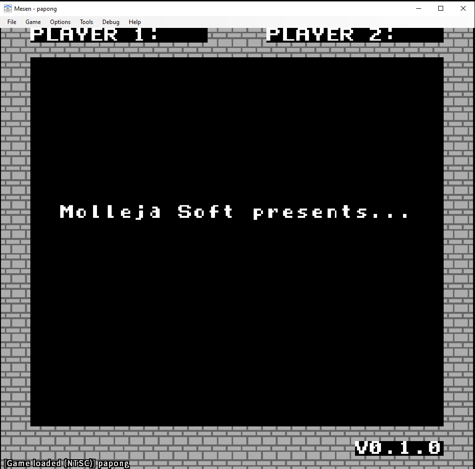
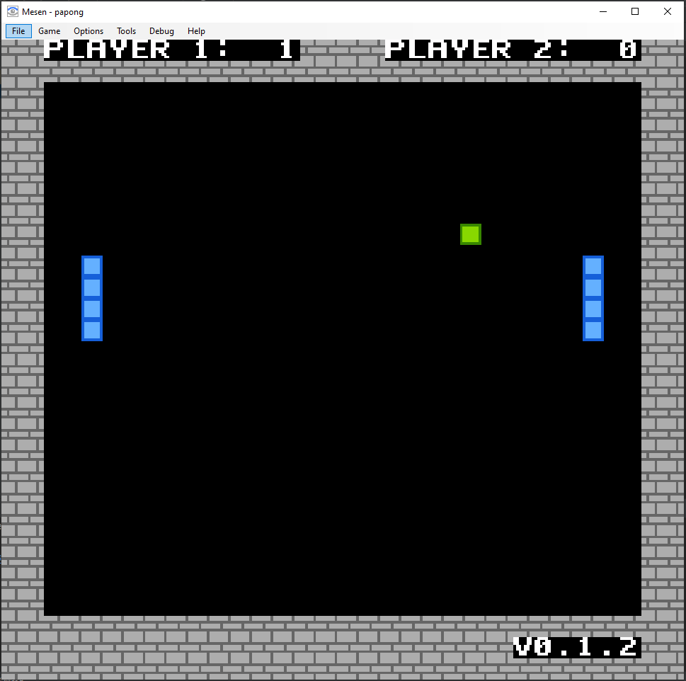

# Papong - A Pong-like NES Game

Welcome to Papong! This is a Pong-like NES game written in C. I made this game following these fantastic tutorials:

* **nesdoug**: https://nesdoug.com


## How to play

* I provide the NES rom already compiled [here](dist/papong.nes).
* Download a NES emulator. I tested this rom using [Mesen](https://www.mesen.ca/)
* Open the rom with the emulator. You can play with **Up arrow** (up) and **Down arrow** (down) for Player 1. **w** (up) and **s** (down) for player 2.
* The first player to reach **5** points wins.

Here are some images:





## How to compile it

* Download the [cc65 package](https://cc65.github.io/) which contains the C compiler, assembler and linker for the 6502 (NES).
* Set the **bin** directory of **cc65** in your **PATH** env.
* You can execute the following command to compile the game on Windows:

```bash
.\compile.bat
```

* Or Linux:

```bash
./compile.sh
```